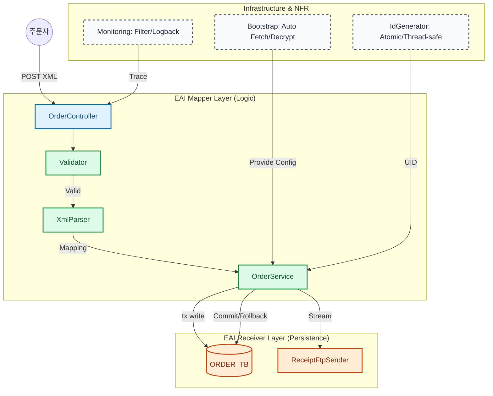

# Inspien EAI 연계 시스템 개발 과제

본 프로젝트는 Inspien 신입/경력 개발자 과제를 위해 구현된 **EAI(Enterprise Application Integration) 연계 시스템**입니다. 실시간 주문 처리(Scenario 1)와 배치 운송 처리(Scenario 2)를 중심으로, 견고한 트랜잭션 관리와 자동화된 인프라 설정을 포함하고 있습니다.

---

## 🚀 핵심 구현 요약

-   **Scenario 1 (실시간 주문)**: XML(1:N) 데이터를 수신하여 유효성 검증 후 DB 적재 및 영수증 파일을 FTP로 전송합니다.
-   **Scenario 2 (운송 배치)**: 5분 주기로 미전송 주문건을 조회하여 운송 정보를 생성하고 상태를 업데이트합니다.
-   **Bootstrap 자동화**: 시스템 부팅 시 과제 제공 API를 호출, AES-128 복호화 과정을 거쳐 DB 및 FTP 접속 정보를 동적으로 구성합니다.
-   **견고성 (NFR)**: JDBC commit 지연 전략을 통해 DB-FTP 간 데이터 정합성을 보장하며, 모든 요청은 필터 기반 로그로 추적됩니다.

---

## 🏗 시스템 아키텍처

EAI의 핵심 패턴인 **Sender-Mapper-Receiver** 구조를 기반으로 설계되었습니다.



1.  **Sender (연계 시작)**
    -   `OrderController`: REST API를 통해 외부 XML 주문 요청 수신.
    -   `ShipmentScheduler`: 5분 주기 스케줄링을 통한 배치 트리거.
2.  **Mapper (변환 및 처리)**
    -   `OrderXmlParser`: XML 데이터를 도메인 객체로 변환 (1:N 매핑 대응).
    -   `OrderValidator`: 비즈니스 규칙 및 필수 필드 유효성 검증.
    -   `OrderService` / `ShipmentBatchService`: 비즈니스 로직 오케스트레이션.
3.  **Receiver (연계 대상)**
    -   `OrderRepository` / `ShipmentRepository`: Oracle DB 연동 (JDBC).
    -   `ReceiptFtpSender`: 영수증 파일 FTP 전송.

---

## 🛠 기술 스택

-   **Framework**: Spring Boot 4.1.0 (Java 21)
-   **Database**: Oracle DB (JDBC)
-   **Protocol**: REST (HTTP), FTP (Apache Commons Net)
-   **Security**: AES-128 (BCrypt SHA-1 Key Derivation)
-   **Logging**: SLF4J / Logback (Request-scoped tracking)

---

## 📋 실행 방법

### 1. 사전 준비
-   `src/main/resources/application-secret.yml` 파일에 과제에서 제공받은 `applicantKey`와 `phoneNumber`를 설정해야 합니다. (보안을 위해 Git 관리 제외)

```yaml
inspien:
  provisioning:
    applicant-key: "YOUR_KEY"
    phone-number: "010-XXXX-XXXX"
```

### 2. 빌드 및 실행
```bash
./gradlew clean build
java -jar build/libs/inspien-assignment-0.0.1-SNAPSHOT.jar
```

### 3. API 테스트
-   **주문 수신 (POST)**: `http://localhost:8080/orders` (XML 본문)
-   **로그 확인**: `logs/monitoring.log`에서 단계별 처리 내역 확인 가능.

---

## 📐 주요 설계 결정 사항 (Trade-offs)

-   **트랜잭션 전략**: FTP는 트랜잭션 지원이 되지 않으므로, DB 적재 후 FTP 전송이 성공했을 때만 DB를 commit하는 **'JDBC Commit 지연 전략'**을 선택했습니다.
-   **채번 관리**: `AtomicInteger` 기반의 인메모리 채번기를 구현하여 대량 요청 시에도 중복 없는 주문 ID 생성을 보장하며, 충돌 시 재시도 로직을 포함했습니다.
-   **보안**: 민감한 접속 정보는 코드나 설정 파일에 직접 노출하지 않고, 부팅 시 동적으로 복호화하여 메모리 내에서만 관리하도록 설계했습니다.

---

## 📄 산출물 문서 (docs/)
-   `PRD.md`: 상세 요구사항 분석 및 매핑
-   `design.md`: 클래스 구조 및 데이터 흐름 설계
-   `CHECKLIST.md`: 기능 구현 단계별 추적표

---
**Candidate**: 문영훈 (myh7754@gmail.com)
