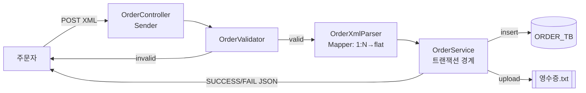
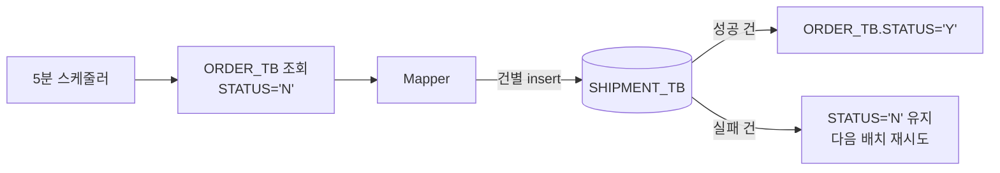
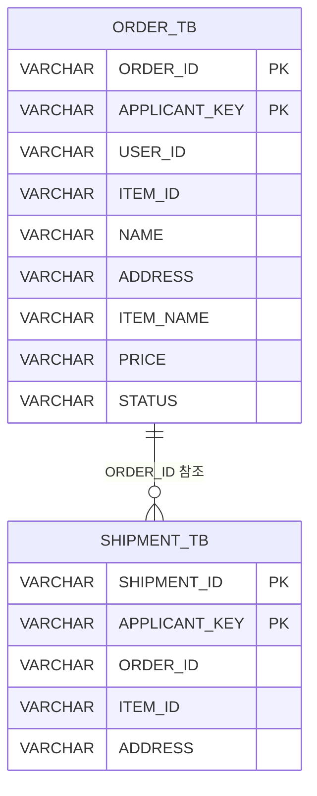
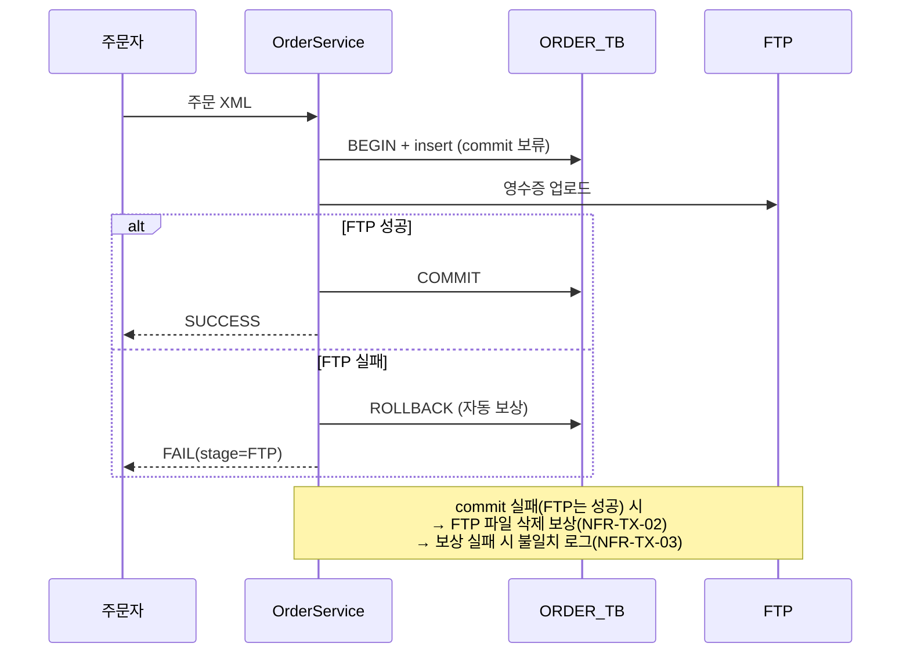

# 설계문서 (Design) — Inspien EAI 연계 시스템

> PRD(`docs/PRD.md`)가 정의한 요구사항을 **어떻게 구현할지** 결정하는 문서.
> 요구사항 ID(`FR-*`, `NFR-*`)를 참조해 추적성을 유지한다.
> 과제 필요 역량 A2(연계흐름)·A3(매핑 정합성)·A5(아키텍처 설명)을 보이는 산출물.

| 항목 | 값 |
|------|-----|
| 아키텍처 패턴 | EAI Sender → Mapper → Receiver |
| 런타임 | Java 21 / Spring Boot 4.1.0 |
| 통신 | S1: REST(동기) / S2: 스케줄러(배치) |
| 영속화 | JDBC (ORDER_TB, SHIPMENT_TB) + FTP(파일) |

---

## 1. EAI 패턴 매핑 (Sender-Mapper-Receiver)

과제의 핵심 개념. 각 시나리오를 EAI 3요소로 분해한다.

| 시나리오 | Sender (들어오는 연결) | Mapper (변환) | Receiver (나가는 연결) |
|----------|------------------------|---------------|------------------------|
| **S1 실시간** | REST Controller (주문 XML 수신) | XML 1:N → flat 레코드 | ① JDBC → ORDER_TB ② FTP → 영수증 파일 |
| **S2 배치** | Scheduler (5분 트리거 + ORDER_TB 조회) | flat → SHIPMENT 레코드 | JDBC → SHIPMENT_TB (+ ORDER_TB STATUS 갱신) |

> S2의 Sender는 "외부 요청"이 아니라 "스케줄러 + DB 조회"다. EAI에서 Sender는 *연계의 시작점*을 의미하므로, 시간 기반 트리거도 Sender로 본다.

---

## 2. 패키지 / 클래스 구조

EAI 3요소를 **도메인별 수직 슬라이스**로 배치한다.

```
co.inspien.assignment
├── bootstrap/                  # 제공 API 호출 + 복호화 (FR-BOOT)
│   ├── ProvisioningClient      # POST RecruitingTest 호출 (Sender)
│   ├── ConnectionInfoDecryptor # AES-128 복호화 (FR-BOOT-02)
│   ├── ConnectionInfo          # 복호화된 접속정보 (record, 메모리 보관)
│   └── SampleDataProvider      # SAMPLE_DATA base64/EUC-KR 디코딩
│
├── order/                      # 시나리오 1 (FR-S1)
│   ├── OrderController         # Sender: REST 수신 + 응답
│   ├── OrderXmlParser          # Mapper: XML → flat
│   ├── OrderValidator          # 검증 (FR-S1-01-a)
│   ├── OrderService            # 오케스트레이션 + 트랜잭션 경계
│   ├── OrderRepository         # Receiver: JDBC → ORDER_TB
│   └── ReceiptFtpSender        # Receiver: FTP 파일 전송
│
├── shipment/                   # 시나리오 2 (FR-S2)
│   ├── ShipmentScheduler       # Sender: 5분 트리거
│   ├── ShipmentBatchService    # 오케스트레이션 (건별 처리)
│   └── ShipmentRepository      # Receiver: JDBC → SHIPMENT_TB, STATUS 갱신
│
└── common/                     # 시나리오 3 공통 (NFR)
    ├── id/IdGenerator          # 채번기 (NFR-ID, 대문자1+숫자3)
    ├── log/MonitoringLogger    # 요청단위 로컬파일 로그 (NFR-LOG)
    └── exception/              # 예외 정의 + 핸들러 (NFR-EXC)
```

`★ 설계 의도`: Sender/Mapper/Receiver를 **클래스 이름에 드러나게** 했다(Controller=Sender, Parser=Mapper, Repository/FtpSender=Receiver). 코드에서 EAI의 각 역할이 어디인지 바로 드러나게 하기 위함.

---

## 3. 데이터 흐름도

### 3.1 시나리오 1 (실시간)



### 3.2 시나리오 2 (배치) — `N`/`Y` 깃발이 연결고리



---

## 4. ERD 및 DDL

> ⚠️ DBMS 미확정(C-02). 모든 컬럼은 과제 스펙상 string → `VARCHAR`. 확정 후 길이/타입 미세조정.



```sql
CREATE TABLE ORDER_TB (
    ORDER_ID      VARCHAR(10)  NOT NULL,
    APPLICANT_KEY VARCHAR(50)  NOT NULL,
    USER_ID       VARCHAR(50),
    ITEM_ID       VARCHAR(50),
    NAME          VARCHAR(100),
    ADDRESS       VARCHAR(200),
    ITEM_NAME     VARCHAR(100),
    PRICE         VARCHAR(20),
    STATUS        VARCHAR(1),
    PRIMARY KEY (ORDER_ID, APPLICANT_KEY)
);

CREATE TABLE SHIPMENT_TB (
    SHIPMENT_ID   VARCHAR(10)  NOT NULL,
    APPLICANT_KEY VARCHAR(50)  NOT NULL,
    ORDER_ID      VARCHAR(50),
    ITEM_ID       VARCHAR(50),
    ADDRESS       VARCHAR(200),
    PRIMARY KEY (SHIPMENT_ID, APPLICANT_KEY)
);
```

---

## 5. 필드 매핑표 (A3 정합성 핵심)

### 5.1 시나리오 1: XML → flat → ORDER_TB → 영수증 파일

| 원본(XML) | flat 레코드 | ORDER_TB 컬럼 | 영수증 파일 필드(순서) | 비고 |
|-----------|-------------|---------------|------------------------|------|
| — | (생성) | ORDER_ID | 1 | 채번 (NFR-ID) |
| — | (고정) | APPLICANT_KEY | 4 | 제공키 |
| HEADER.USER_ID = ITEM.USER_ID | userId | USER_ID | 2 | **조인키** |
| ITEM.ITEM_ID | itemId | ITEM_ID | 3 | |
| HEADER.NAME | name | NAME | 5 | |
| HEADER.ADDRESS | address | ADDRESS | 6 | |
| ITEM.ITEM_NAME | itemName | ITEM_NAME | 7 | |
| ITEM.PRICE | price | PRICE | 8 | |
| HEADER.STATUS | — | STATUS | — | 'N' 고정(FR-S1-03-a) |

- **파일 1행**: `ORDER_ID^USER_ID^ITEM_ID^APPLICANT_KEY^NAME^ADDRESS^ITEM_NAME^PRICE\n`
- **파일명**: `INSPIEN_{참여자명}_{yyyyMMddHHmmss}.txt`
- **주의**: 영수증 필드 순서(4번이 APPLICANT_KEY)와 DB 컬럼 순서가 다름 → 매핑 시 혼동 주의

### 5.2 시나리오 2: ORDER_TB → SHIPMENT_TB

| ORDER_TB | SHIPMENT_TB | 비고 |
|----------|-------------|------|
| — | SHIPMENT_ID | 채번 (NFR-ID) |
| APPLICANT_KEY | APPLICANT_KEY | 고정 |
| ORDER_ID | ORDER_ID | |
| ITEM_ID | ITEM_ID | |
| ADDRESS | ADDRESS | |

---

## 6. 트랜잭션 / 보상 설계 (NFR-TX) — S1 핵심

**전략 B**: JDBC 트랜잭션의 commit을 FTP 성공 이후로 미룬다. FTP는 트랜잭션 멤버가 아니라 commit 조건.



| 실패 지점 | 처리 | 요구사항 |
|-----------|------|---------|
| 검증 | 즉시 FAIL 반환, 적재 안 함 | NFR-EXC-03 |
| insert | rollback, FAIL 반환 | NFR-EXC-01 |
| FTP | rollback(공짜 보상), FAIL 반환 | NFR-TX-01 |
| commit (FTP 성공) | FTP 파일 삭제 보상 | NFR-TX-02 |
| 보상마저 실패 | 불일치 로그, 수동개입 | NFR-TX-03 |

> **S1 vs S2 트랜잭션 차이**: S1은 단건 원자성(전부 or 전무). S2는 다건 **건별** 처리 — 실패 건은 `STATUS='N'` 유지로 다음 배치 재시도(FR-S2-03-a). `N`/`Y` 깃발이 재시도 큐 역할.

---

## 7. 채번 설계 (NFR-ID)

- 형식: `[A-Z][0-9]{3}` (대문자1 + 숫자3, 예 `A113`)
- 단일 인스턴스 가정(A-01) → **JVM 내 동시성 도구로 방어**
- 충돌(중복 PK) 시 재채번 후 재시도(NFR-ID-02)

> 구체 알고리즘(시작값/증가규칙/동시성 수단)은 구현 단계에서 확정. 후보: DB max+1 조회 vs 인메모리 `AtomicInteger` vs DB 시퀀스. **TBD — 같이 결정할 항목.**

---

## 8. 예외 / 로그 설계 (NFR-EXC, NFR-LOG)

- **모니터링 로그**: 요청 단위로 로컬 파일 기록. 필드: `추적ID, 타임스탬프, 단계(검증/JDBC/FTP/배치), 결과(성공/실패), 사유`
- **예외 계층**: 검증예외 / JDBC예외 / FTP예외를 구분해 단계 식별 가능하게
- 접속정보·개인정보는 로그에 노출 금지(FR-BOOT-03-a)

> 구체 구현(로그 포맷, 파일 분리 전략)은 구현 단계에서. **TBD — 같이 결정할 항목.**

---

## 부록. 미결정 항목 (TBD)

| # | 항목 | 결정 시점 |
|---|------|-----------|
| 1 | DBMS 종류 → DDL 타입 확정 | Bootstrap 복호화 후 |
| 2 | 채번 알고리즘(인메모리 vs DB) | 구현 직전 |
| 3 | 로그 포맷/파일 분리 전략 | 구현 직전 |
